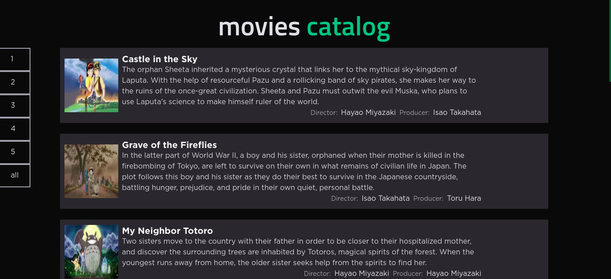

# Movies Catalog

<p>
  Movies catalog é um desafio da WaProject, cujo objetivo era criar um catalogo de filmes.
</p>

## URL da aplicação

```
https://movies-catalog-wa-project.vercel.app/
```

## Instação

### Clone o repositório

```
git clone https://github.com/jovimoura/movies-catalog-waProject
```

### Acesse o diretorio

```
cd <nome-da-pasta>
```

### Instale as dependências

```
npm install
```

### Inicie a aplicação

```
npm run dev
```

### A aplicação, por padrão, fica na porta:

```
http://localhost:3000/
```

## API:

A API recebe um id, se o id for 1, ele entrega os 10 primeiros itens do array e assim em diante

```
url: https://movies-catalog-wa-project.vercel.app/api/movies/id=?
type: GET
param: id=number
json: [
  {
		"id": "2baf70d1-42bb-4437-b551-e5fed5a87abe",
		"title": "Castle in the Sky",
		"movie_banner": "https://image.tmdb.org/t/p/w533_and_h300_bestv2/3cyjYtLWCBE1uvWINHFsFnE8LUK.jpg",
		"description": "The orphan Sheeta inherited a mysterious crystal that links her to the mythical sky-kingdom of Laputa. With the help of resourceful Pazu and a rollicking band of sky pirates, she makes her way to the ruins of the once-great civilization. Sheeta and Pazu must outwit the evil Muska, who plans to use Laputa's science to make himself ruler of the world.",
		"director": "Hayao Miyazaki",
		"producer": "Isao Takahata"
	},
  ...
]
```

## Imagem do projeto



## Tecnologias utilizadas

<ul>
    <li>Next</li>
    <li>TypeScript</li>
    <li>Tailwind</li>
</ul>

## Feito por:

### João Victor dos Santos Moura

### E-mail: joaovictors.mouraa@gmail.com

### Linkedin: https://www.linkedin.com/in/jovimoura10/
